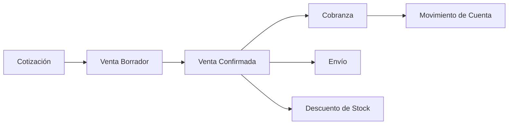
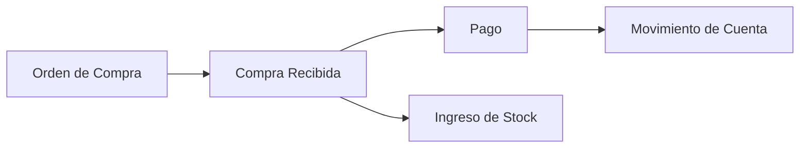
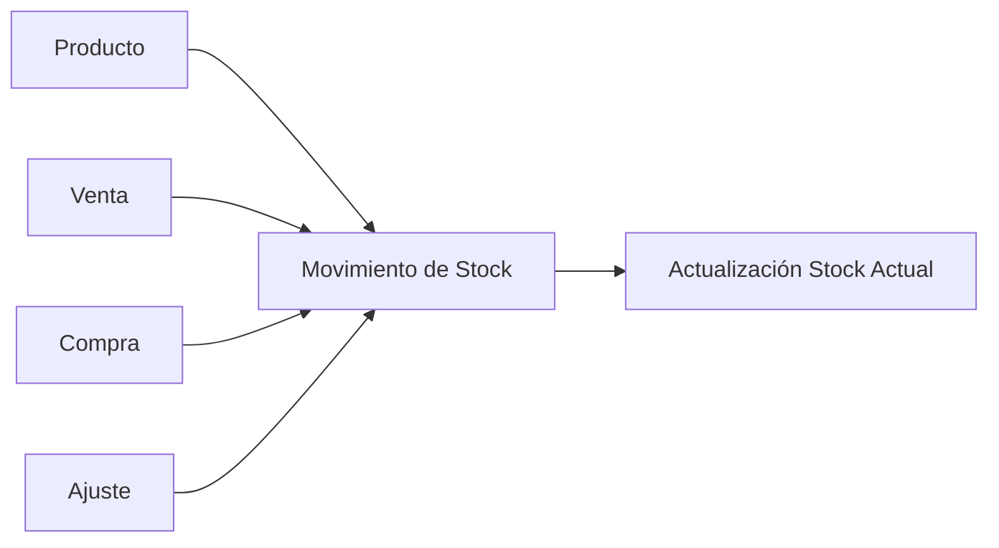

# Grid Manager - Lógica del Programa

## Descripción General

Grid Manager es un **sistema moderno de gestión empresarial** construido con una arquitectura monorepo que incluye una API REST en Node.js con TypeScript y una aplicación web frontend en React con TypeScript. El sistema está diseñado para manejar operaciones comerciales completas incluyendo ventas, compras, inventario, clientes, proveedores y reportes financieros.

## Arquitectura del Sistema

### Estructura del Proyecto

```
Grid Manager/
├── apps/
│   ├── api/          # Backend - API REST con Node.js/Express
│   └── web/          # Frontend - Aplicación React
├── packages/         # Paquetes compartidos
├── docs/            # Documentación
└── docker-compose.yml # Orquestación de servicios
```

### Stack Tecnológico

**Backend (API):**
- **Node.js + Express.js** - Servidor web y API REST
- **TypeScript** - Tipado estático
- **Prisma ORM** - Mapeo objeto-relacional para PostgreSQL
- **PostgreSQL** - Base de datos relacional (Supabase)
- **Redis** - Cache en memoria (opcional)
- **JWT** - Autenticación y autorización
- **Swagger** - Documentación de API

**Frontend (Web):**
- **React 18** - Biblioteca de UI
- **TypeScript** - Tipado estático
- **React Router** - Navegación
- **Tailwind CSS** - Framework de estilos
- **Vite** - Herramienta de build

## Modelo de Datos

### Entidades Principales

#### 1. **Usuarios y Autenticación**
- `User` - Usuarios del sistema con roles (ADMIN, MANAGER, ANALYST, SELLER)
- `Branch` - Sucursales donde trabajan los usuarios
- `AuditLog` - Registro de auditoría de todas las acciones

#### 2. **Gestión de Clientes y Proveedores**
- `Customer` - Clientes con información de contacto y límites de crédito
- `Supplier` - Proveedores con información de contacto y balances

#### 3. **Gestión de Productos e Inventario**
- `Product` - Productos con SKU, precios, stock y categorías
- `PriceList` + `PriceListItem` - Listas de precios flexibles
- `StockMovement` - Movimientos de inventario (IN/OUT/ADJUSTMENT/TRANSFER)

#### 4. **Proceso de Ventas**
- `Quote` - Cotizaciones que pueden convertirse en ventas
- `QuoteItem` - Items de las cotizaciones
- `Sale` - Ventas con estados (DRAFT/PENDING/CONFIRMED/CANCELLED)
- `SaleItem` - Items de las ventas
- `Collection` - Cobranzas asociadas a ventas
- `Shipment` - Envíos de productos vendidos

#### 5. **Proceso de Compras**
- `Purchase` - Órdenes de compra con estados similares a ventas
- `PurchaseItem` - Items de las compras
- `Payment` - Pagos a proveedores

#### 6. **Gestión Financiera**
- `Account` - Cuentas bancarias, cajas, tarjetas
- `AccountMovement` - Movimientos de cuentas
- `Income` - Ingresos diversos
- `Expense` - Gastos diversos
- `ExchangeRate` - Tipos de cambio para múltiples monedas
- `CashRegister` - Manejo de cajas diarias

#### 7. **Sistema de Tareas**
- `Task` - Tareas asignadas a usuarios con estados y fechas de vencimiento

### Vistas y Reportes
- `SalesSummary` - Resumen de ventas por período
- `ProductRanking` - Ranking de productos más vendidos

## Flujo de Procesos de Negocio

### 1. Proceso de Ventas


### 2. Proceso de Compras


### 3. Gestión de Inventario


## Funcionalidades Principales

### Backend API (Puerto 5001)

**Módulos de Rutas:**
- `/auth` - Autenticación y autorización
- `/dashboard` - KPIs y métricas del tablero
- `/customers` - CRUD de clientes
- `/suppliers` - CRUD de proveedores
- `/products` - CRUD de productos e inventario
- `/sales` - Gestión completa de ventas
- `/purchases` - Gestión completa de compras
- `/users` - Administración de usuarios
- `/accounts` - Gestión de cuentas financieras
- `/reports` - Reportes y análisis

**Características Técnicas:**
- **Autenticación JWT** con middleware de protección
- **Validación de datos** con esquemas TypeScript
- **Paginación** implementada en todas las listas
- **Rate limiting** para prevenir abuso
- **CORS** configurado para el frontend
- **Swagger UI** en `/api-docs`
- **Health check** en `/health`
- **Manejo de errores** centralizado

### Frontend Web (Puerto 3000)

**Estructura de Páginas:**
- `LoginPage` - Autenticación de usuarios
- `DashboardPage` - Panel principal con métricas
- `CustomersPage` - Gestión de clientes
- `SuppliersPage` - Gestión de proveedores
- `ProductsPage` - Gestión de productos
- `SalesPage` - Gestión de ventas
- `PurchasesPage` - Gestión de compras
- `UsersPage` - Administración de usuarios
- `AccountsPage` - Gestión financiera
- `ReportsPage` - Reportes y análisis

**Componentes:**
- `Layout` + `Header` + `Sidebar` - Estructura de la aplicación
- `ProtectedRoute` - Protección de rutas autenticadas

## Configuración y Deployment

### Variables de Entorno Clave
- `DATABASE_URL` - Conexión a PostgreSQL (Supabase)
- `JWT_SECRET` - Clave para tokens JWT
- `REDIS_URL` - Conexión a Redis (opcional)
- `CORS_ORIGIN` - Origen permitido para CORS

### Servicios de Infraestructura

**Base de Datos:**
- **PostgreSQL en Supabase** - Base de datos principal
- **Prisma Migrations** - Control de versiones del esquema
- **Seeding** - Datos iniciales del sistema

**Contenedores Docker:**
- `docker-compose.yml` - Orquestación local
- `Dockerfile` - Imagen optimizada para Railway

### Scripts de Desarrollo

**Backend:**
```bash
npm run dev:api          # Servidor de desarrollo
npm run build:api        # Build de producción
npm run db:migrate       # Ejecutar migraciones
npm run db:seed         # Poblar datos iniciales
```

**Frontend:**
```bash
npm run dev:web         # Servidor de desarrollo
npm run build:web       # Build de producción
```

**Proyecto Completo:**
```bash
npm run dev            # Ambos servicios en paralelo
npm run build          # Build completo
```

## Flujos de Autenticación

### 1. Login de Usuario
1. Usuario ingresa email/password en `LoginPage`
2. Frontend envía credenciales a `/api/v1/auth/login`
3. Backend valida credenciales contra la tabla `users`
4. Si es válido, genera JWT token y lo retorna
5. Frontend almacena token y redirige al dashboard

### 2. Protección de Rutas
1. Middleware `auth.ts` verifica JWT en cada request protegido
2. Extrae información del usuario del token
3. Permite o deniega acceso según rol y permisos

## Características de Seguridad

- **Helmet.js** - Headers de seguridad HTTP
- **Rate Limiting** - Prevención de ataques DDoS
- **CORS** - Control de origen de requests
- **JWT con expiración** - Tokens de sesión seguros
- **Validación de inputs** - Prevención de inyecciones
- **Audit logging** - Registro de todas las acciones críticas

## Estado Actual del Desarrollo

El sistema está en **fase de desarrollo activo** con:
- ✅ Arquitectura base implementada
- ✅ Modelo de datos completo
- ✅ API REST funcional
- ✅ Sistema de autenticación
- ✅ Configuración de deployment
- 🚧 Frontend en construcción
- 🚧 Testing suite en desarrollo

## Próximos Pasos

1. **Completar el Frontend** - Implementar todas las páginas CRUD
2. **Sistema de Permisos** - Refinamiento de roles y permisos
3. **Reportes Avanzados** - Gráficos y análisis de datos
4. **Testing Completo** - Unit tests y integration tests
5. **Optimización** - Performance y caching strategies
6. **Monitoring** - Logs, métricas y alertas

## Conclusión

Grid Manager es un sistema empresarial robusto y escalable, diseñado con las mejores prácticas de desarrollo moderno. Su arquitectura modular permite un mantenimiento eficiente y futuras expansiones del sistema.